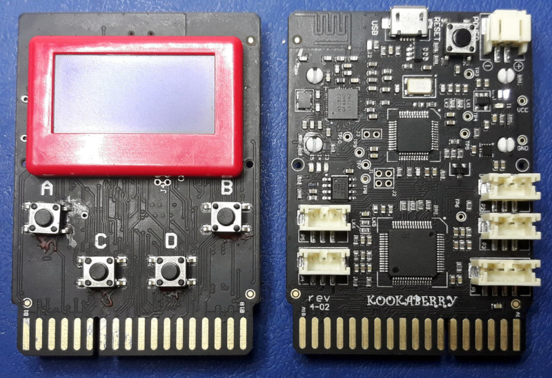

.. _kookaberry_quickref:

Reference for the Kookaberry
==================================

This is a quick reference for the Kookaberry.  For further details see
the documentation on the Kookaberry-specific modules just below.

.. toctree::
   :maxdepth: 1

   kooka.rst
   sh1106.rst
   lsm303.rst
   nrf51.rst

Internal LEDs
-------------

See :ref:`kooka.LED <kooka.LED>`. ::

    import kooka

    kooka.led_red.on()
    kooka.led_green.toggle()
    kooka.led_green.off()

Internal buttons
----------------

See :ref:`kooka.Button <kooka.Button>`. ::

    import kooka

    print(kooka.button_a.is_pressed())
    print(kooka.button_a.was_pressed())

Internal display
----------------

See :ref:`sh1106.SH1106_SPI <sh1106.SH1106_SPI>`. ::

    from kooka import display

    display.print('hello', 123)     # print objects to the display directly
    display.contrast(255)           # set maximum contrast
    display.invert(True)            # invert all pixels

    display.fill(0)                 # clear the display
    display.line(4, 5, 60, 40, 1)   # draw a line
    display.show()                  # show the frame buffer to the display

Internal accelerometer
----------------------

See :ref:`lsm303.LSM303C_Accel <lsm303.LSM303C_Accel>`. ::

    from kooka import accel

    print(accel.get_xyz())          # get and print the x/y/z acceleration values

Internal compass
----------------

See :ref:`lsm303.LSM303C_Mag <lsm303.LSM303C_Mag>`. ::

    from kooka import compass

    print(compass.get_xyz())        # get and print the x/y/z magnetic values
    print(compass.get_strength())   # get and print the magnetic field strength

Internal radio
--------------

See :ref:`nrf51.Radio <nrf51.Radio>`. ::

    from kooka import radio

    radio.enable()                  # enable the radio
    radio.config(power=7)           # set maximum power
    radio.send('hello')             # send a message
    print(radio.receive())          # retrieve any messages on the queue

Delay and timing
----------------

Use the :mod:`time <utime>` module::

    import time

    time.sleep(1)           # sleep for 1 second
    time.sleep_ms(500)      # sleep for 500 milliseconds
    time.sleep_us(10)       # sleep for 10 microseconds
    start = time.ticks_ms() # get value of millisecond counter
    delta = time.ticks_diff(time.ticks_ms(), start) # compute time difference

Pins and GPIO
-------------

See example below

    from machine import Pin

    p_out = Pin('P2', Pin.OUT)  # create a Pin object, in output mode
    p_out.high()                # set the pin high
    p_out.low()                 # set the pin low

    p_in = Pin('P3', Pin.IN, Pin.PULL_UP) # input mode with pull-up resistor
    p_in.value()                # get value, 0 or 1

Timers
------

See example below

    from machine import Timer

    tim = Timer(3, freq=1000)   # create Timer 3, running at 1000Hz
    tim.freq(1)                 # change frequency to 1 Hz

    # toggle an LED at the frequency of the timer
    tim.callback(lambda t: kooka.led_green.toggle())

RTC (real time clock)
---------------------

See example below

    from machine import RTC

    rtc = RTC()                 # access the RTC
    rtc.datetime((2017, 8, 23, 1, 12, 48, 0, 0)) # set a specific date and time
    print(rtc.datetime())       # get date and time

PWM (pulse width modulation)
----------------------------

See example below

    from machine import PWM

    pwm = PWM('P2')             # create PWM object on connector P2
    pwm.freq(1000)              # set PWM frequency to 100Hz
    pwm.duty(50)                # set duty to 50%

ADC (analog to digital conversion)
----------------------------------

See see example below

    from machine import ADC

    adc = ADC('P4')             # create ADC object on connector P4
    print(adc.read())           # read value, in range 0-4095

DAC (digital to analog conversion)
----------------------------------

See see example below

    from machine import DAC

    dac = DAC('P4')             # create DAC object on connector P4
    dac.write(120)              # output value, in range 0-255

UART serial bus
---------------

See example below

    from machine import UART

    uart = UART(6, 9600)    # create UART 6 with baudrate 9600
    uart.write('hello')     # write 5 bytes
    uart.read(5)            # read up to 5 bytes

I2C bus
-------

See example below

    from machine import I2C

    i2c = I2C('P1')         # construct an I2C bus on connector P1

    i2c.readfrom(0x3a, 4)   # read 4 bytes from slave device with address 0x3a
    i2c.writeto(0x3a, '12') # write '12' to slave device with address 0x3a

    buf = bytearray(10)     # create a buffer with 10 bytes
    i2c.writeto(0x3a, buf)  # write the given buffer to the slave

SPI bus
-------

See example below

    from machine import SPI

    spi = SPI('DISP')       # access the SPI bus connected to the display

    spi.read(10)            # read 10 bytes on MISO
    spi.read(10, 0xff)      # read 10 bytes while writing 0xff on MOSI
    spi.write(b'12345')     # write 5 bytes on MOSI

    buf = bytearray(4)      # create a buffer
    spi.write_readinto(b'1234', buf) # write to MOSI and read from MISO into the buffer

Servo control
-------------

See :ref:`kooka.Servo <kooka.Servo>`. ::

    from kooka import Servo

    s1 = Servo('P2')    # servo on connector P2
    s1.angle(45)        # move to 45 degrees
    s1.angle(-60, 1500) # move to -60 degrees in 1500ms
    s1.speed(50)        # for continuous rotation servos

